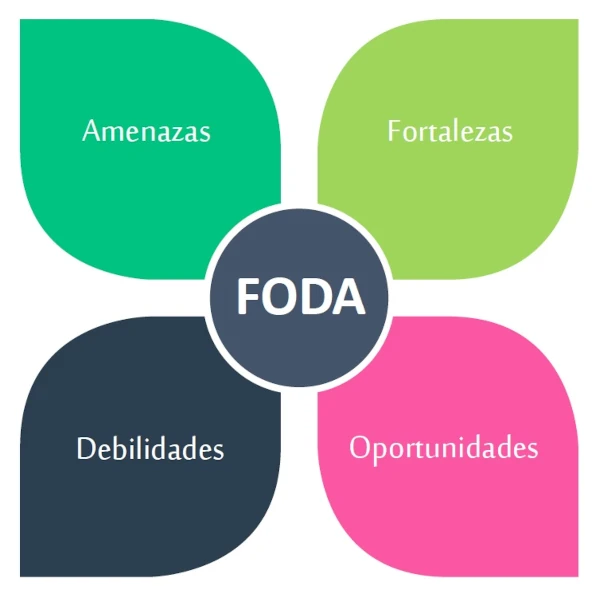
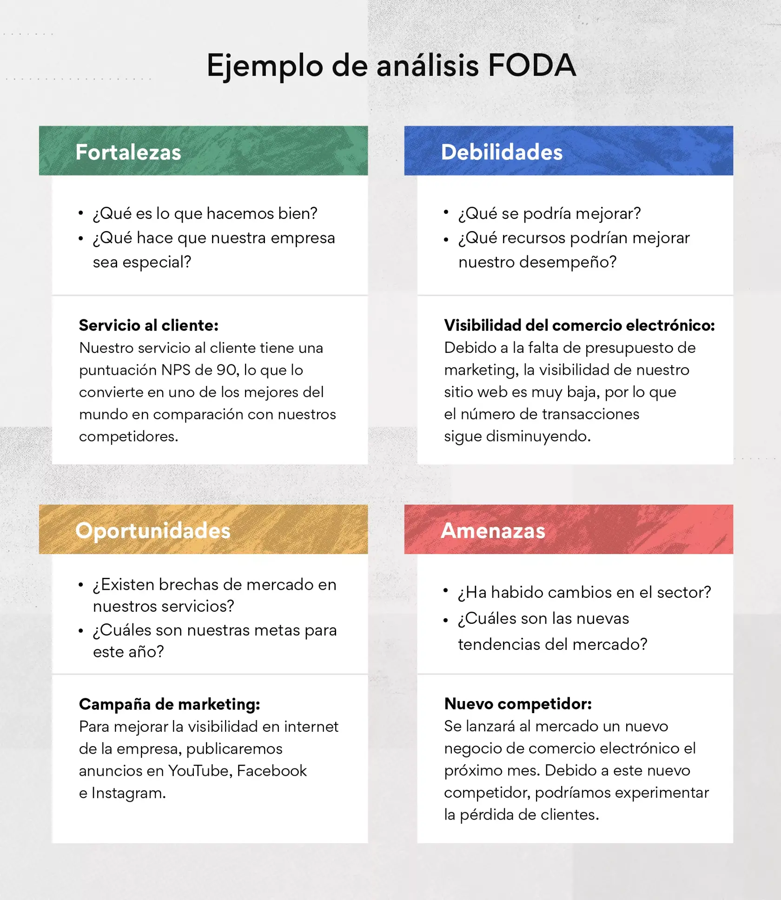

# Analisis FODA

## Agregando una imágen a nuestro archivo index.html
Si quiero agregar una imágen, voy a usar el elemento:
```sh

```
NOTA:(public/images/Analisis_FODA.webp) es el paso correcto para que se pueda acceder a la imagen y luego mostrarla en nuestra página, entonces:
* 1er paso: accedo a la carpeta public.
* 2do paso: accedo a la carpeta images.
* 3er paso: escribimos el nombre de la imagen que queremos mostrar.

## Editando la imágen
Para poder editar la imágen, al elemento img le agregé una clase "imagen".
```sh

```
Gracias a esto, voy a poder editar la imágen del archivo index.html en un archivo style.css:
```sh
.imagen{
    width: 400px; # será el ancho de la imágen
    height: auto; # la altura de la imágen
}
```
Esto lo hice con el fin de poer achicar un poco la imágen, ya que era algo grande a la vista de uno.

## Agregando elementos de anclaje
Para crear hipervínculos que nos permita navegar a otra pág, con el objetivo de saber más del tema, usaré el siguiente elemento:
```sh
<a href="https://raulloaiza.com/ventajas-y-desventajas-del-foda/blog/" target="_blank">ventajas y desventajas</a>
```
* En el href irá la dirección de la página
* La función de tareget="_blank", es que abrirá otra pestaña al momento de navegar, entonces con esto logro que siga la pestaña de mi página.

### Agregando un elemento anclaje al elemento imágen
La imágen que agrego estará identada a un elemento de anclaje, con la finalidad de que se amplie más la imágen, pero en otra pestaña ( utilizando nuevamente el target="_blank"):
```sh
<a href="https://assets.asana.biz/transform/485b5890-ad68-4914-bace-de38f4d2a650/inline-project-management-SWOT-analysis-4-es-2x?io=transform:fill,width:1680&format=webp" target="_blank"></a>
```

## Dandole diseño al texto
Al momento de darle diseño al texto, me traeré (de google fonts) una fuente, este se lo voy a aplicar a todo el texto que se encuentre dentro de mi elemento body, menos al elemento h1:

```sh
@import url('https://fonts.googleapis.com/css2?family=Rajdhani:wght@300;400;500;600;700&display=swap');

body{
    font-family: "Rajdhani", sans-serif;
    font-size: 20px;
    font-weight: 400;
}

h1{
    font-family: Impact, Haettenschweiler, 'Arial Narrow Bold', sans-serif;
    font-size: 50px; # Tamaño de letra para el título
    text-align: center; # Centro el título
}
```
* Cómo se ve, en h1 le voy a declarar una fuente segura, la función de este diseño es lograr que no herede la fuente que importé de google fonts. También le daré al título un tamaño más grande que el de los demás.

Entonces ya declaré la fuente para los demás elementos, lo que me queda solamente es cambiar su tamaño en cáda uno:
```sh
h2{
    font-size: 40px;
}
h3{
    font-size: 35px;
}
h4{
    font-size: 25px;
}

p{
    font-size: 20px;
}
```

## Dándole color a los elementos que contiene texto
Al momento de darle color a los elementos h2, h3 y h4, lo haré en css de la siguiente manera:
```sh
h2, h3, h4{
    color: rgb(136, 24, 24); # creo un color similar al bordó
}
```
* Escribiendo de esta manera, logro darle el mismo color a los 3 elementos, de esta manera me ahorro de estar escribiendo el color en cáda uno. 

Para el elemento h1 será distinto, ya que trabajaré con color blanco su título y tendrá un fondo oscuro:
```sh
h1{
    color: white;
    background-color: black;
}
```
Tambien la agregué un color para lo que contenga elemento em:
```sh
em{
    color: rgb(186, 3, 3);
}
```

### Dándo color y decoración en elemento de anclaje
Al elemento a (de anclaje), le estaré dando decoración al momento de que se pare sobre el texto y cuando no:
```sh
a{
    color: blue;
    text-decoration: none; # no tendrá linea
}
a:hover{ # cuando me paro con el mouse sobre el texto
    text-decoration: underline; # se genera una línea debajo
}
```